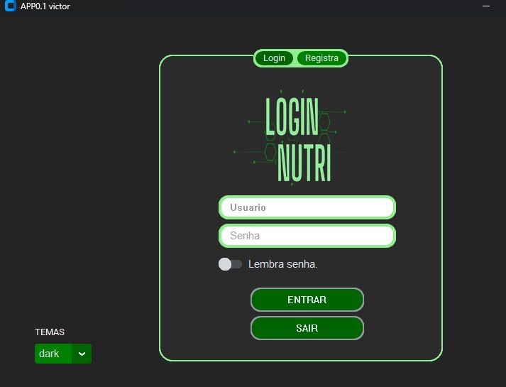
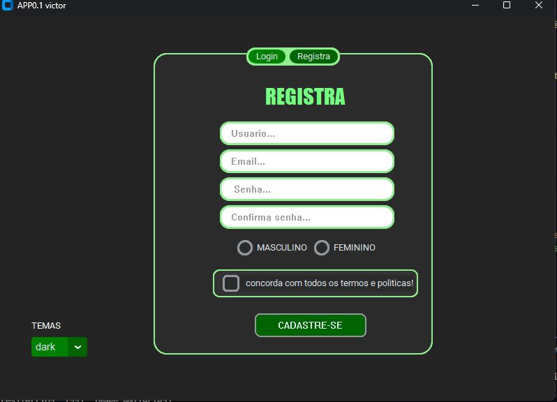
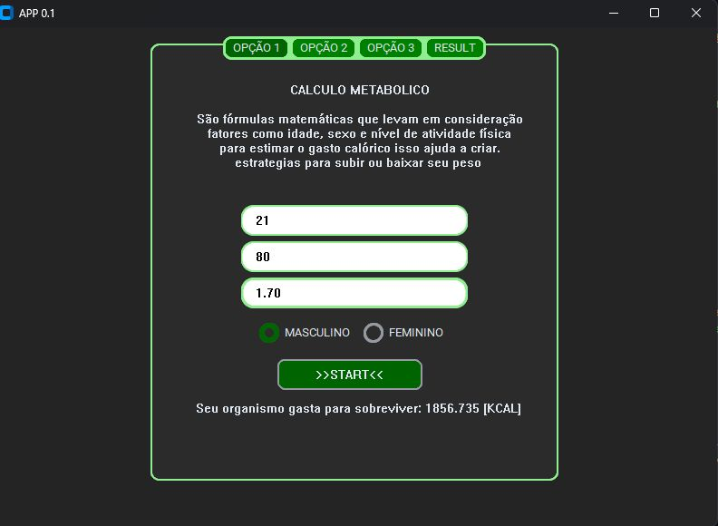
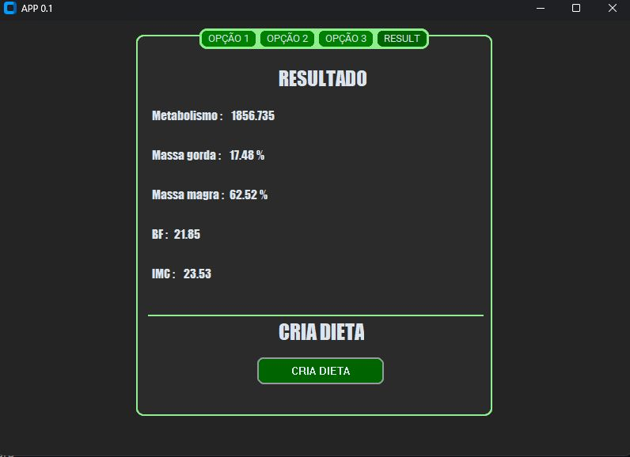
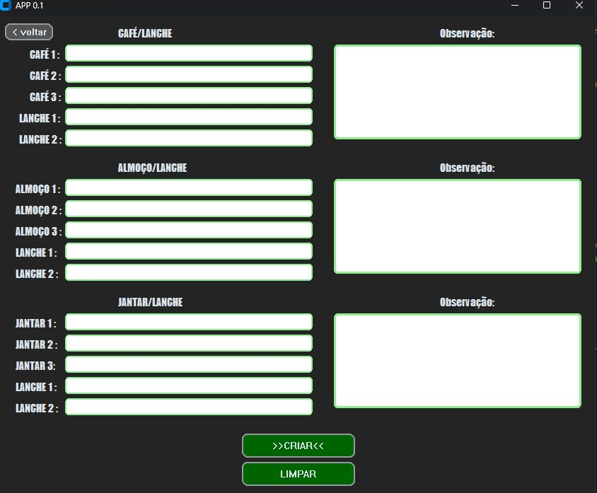

# app_nutri_0.1 em Python
Bem-vindo ao projetoapp_nutri_0.1 em Python, uma aplicação desenvolvida em Python utilizando as bibliotecas,  CustomTkinter, Tkinter, Openpyxl e SQLite3. Este projeto visa fornecer uma descrição  um aplicativo que permite fazer alguns calculos como imc, ver % de gordura alem de pode criar dietas.

  
  

# Visão Geral
O Projeto é uma aplicação que permite fazer calculo imc entre outras aplicações alem de permite criar excel para gera dietas.

# Tecnologias Utilizadas
-**Python**: A linguagem de programação principal para o desenvolvimento da aplicação. 
-**CustomTkinter**: Uma biblioteca customizada baseada no Tkinter, utilizada para criar interfaces gráficas. 
-**Tkinter**: Biblioteca padrão para interfaces gráficas em Python. 
-**Openpyx**l: Biblioteca para manipulação de arquivos Excel (xlsx). 
-**SQLite3**: Sistema de gerenciamento de banco de dados embutido na aplicação. 
# Instalação
Certifique-se de ter o Python instalado em sua máquina. Em seguida, instale as bibliotecas necessárias:

**pip install customtkinter tkinter openpyxl**
# Como Usar
Clone o repositório:

**git clone https://github.com/seu-usuario/projeto-xyz.git** 
Navegue até o diretório do projeto: 

cd projeto 
Execute a aplicação: 

**python main.py** 
Certifique-se de que todas as dependências estão instaladas corretamente. 

Explore as funcionalidades da aplicação através da interface gráfica. 

# Contribuição
Se você deseja contribuir para o Projeto , sinta-se à vontade para criar pull requests ou issues no repositório do GitHub.
